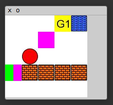

# MazeBase: a sandbox for learning from games
This code is for a simple 2D game environment that can be used in developing reinforcement learning models. It is designed to be compact but flexible, enabling the implementation of diverse set of tasks. Furthermore, it offers precise tuning of the task difficulty, facilitating the construction of curricula to aid training. The code is in Lua+Torch, and it offers rapid prototyping of games and is easy to connect to models that control the agent’s behavior.

## Environment
Each game is played in a 2D rectangular grid. Each location in the grid can be empty, or may contain one or more items such as:
- **Block:** an impassible obstacle that does not allow the agent to move to that grid location
- **Water:** the agent may move to a grid location with water, but incurs an additional cost of for doing so.
- **Switch:** a switch can be in one of M states, which we refer to as colors. The agent can toggle through the states cyclically by a toggle action when it is at the location of the switch .
- **Door:** a door has a color, matched to a particular switch. The agent may only move to the door’s grid location if the state of the switch matches the state of the door.
- **PushableBlock:** This block is impassable, but can be moved with a separate “push” actions. The block moves in the direction of the push, and the agent must be located adjacent to the block opposite the direction of the push.
- **Corner:** This item simply marks a corner of the board.
- **Goal:** depending on the task, one or more goals may exist, each named individually.
- **Info:** these items do not have a grid location, but can specify a task or give information necessary for its completion.

The environment is presented to the agent as a list of sentences, each describing an item in the game. For example, an agent might see “Block at [-1,4]. Switch at [+3,0] with blue color. Info: change switch to red.” However, note that we use egocentric spatial coordinates, meaning that the environment updates the locations of each object after an action. The environments are generated randomly with some distribution on the various items. For example, we usually specify a uniform distribution over height and width, and a percentage of wall blocks and water blocks.

## Tasks/Games
Currently, there are 10 different tasks (sometimes we would call them "game") implemented, but it is possible to add new tasks. The existing tasks are:
- **Multigoals:** the agent is given an ordered list of goals as “Info”, and needs to visit the goals in that order.
- **Conditional Goals:** the agent must visit a destination goal that is conditional on the state of a switch. The “Info” is of the form “go to goal 4 if the switch is colored red, else go to goal 2”.
- **Exclusion:** the “Info” in this game specifies a list of goals to avoid. The agent should visit all other unmentioned goals.
- **Switches:** there are multiple switches on the board, and the agent has to toggle all switches to the same color.
- **Light Key:** there is a switch and a door in a wall of blocks. The agent should navigate to a goal which may be on the wrong side of a wall of blocks, in which the agent needs move to and toggle the switch to open the door before going to the goal.
- **Goto:** the agent is given an absolute location on the grid as a target. The game ends when the agent visits this location. Solving this task requires the agent to convert from its own egocentric coordinate representation to absolute coordinates.
- **Goto Hidden:** the agent is given a list of goals with absolute coordinates, and then is told to go to one of the goals by the goal’s name. The agent is not directly given the goal’s location, it must read this from the list of goal locations.
- **Push block:** the agent needs to push a Pushable block so that it lays on top of a switch.
- **Push block cardinal:** the agent needs to push a Pushable block so that it is on a specified edge of the maze, e.g. the left edge. Any location along the edge is acceptable.
- **Blocked door:** the agent should navigate to a goal which may lie on the opposite side of a wall of blocks, as in the Light Key game. However, a PushableBlock blocks the gap in the wall instead of a door.

Examples of each tasks are shown in this [video](https://youtu.be/kwnp8jFRi5E). The internal parameters of the tasks are written to a [configuration file](https://github.com/facebook/MazeBase/blob/master/games/config/game_config.lua), which can be easily modified.

## Using Game Environment
To use the game environment as standalone in Torch, first include it with 
``` 
dofile('games/init.lua') 
```
Then we have to set which config file to use. Here we are using a config that used in our [paper](http://arxiv.org/abs/1511.07401)
```
g_opts = {games_config_path = 'games/config/game_config.lua'}
```
Next, we call this function to create a dictionary with all necessary words used in the game
```
g_init_vocab()              
```
Finally, initialize the game environment with
```
g_init_game()
```
Now we can create a new game instance by calling
```
g = new_game()
```
If there are more than one games, it will randomly pick one. Now, the current game state can be retrieved by calling 
```
s = g:to_sentence()
```
which would return a tensor containing words (encoded by `g_vocab` dictionary) describing each item in the game. If you have display package installed, you can see the game on your browser by doing
```
g_disp = require('display')
g_disp.image(g.map:to_image())
```



Next, an action can be performed by calling
```
g:act(action)
```
where `action` is the index of the action. The list of possible actions are in `g.agent.action_names`. When there are multiple agents in the game, we can choose the agent to perform the action by doing
```
g.agent = g.agents[i]
```
before calling `g:act()`. After the action is completed, `g:update()` must be called so that the game will update its internal state.
Finally, we can check if the game finished by calling `g:is_active()`.

## Creating a new game


## Training an agent using neural networks
We also provide a code for training different types of neural models with policy gradient method. Training uses CPUs with multi-threading for speed up.
The implemented models are

1. multi-layer neural network
2. convolutional neural network
3. [end-to-end memory network](http://arxiv.org/abs/1503.08895).

For example, running the following command will train a 2-layer network on MultiGoals.
```
th main.lua --hidsz 20 --model mlp --nlayers 2 --epochs 100 --game MultiGoals --nactions 6 --nworkers 2
```
To see all the command line options, run 
```
th main.lua -h
  --hidsz             the size of the internal state vector [20]
  --nonlin            non-linearity type: tanh | relu | none [tanh]
  --model             model type: mlp | conv | memnn [memnn]
  --init_std          STD of initial weights [0.2]
  --max_attributes    maximum number of attributes of each item [6]
  --nlayers           the number of layers in MLP [2]
  --convdim           the number of feature maps in convolutional layers [20]
  --conv_sz           spatial scope of the input to convnet and MLP [19]
  --memsize           size of the memory in MemNN [20]
  --nhop              the number of hops in MemNN [3]
  --nagents           the number of agents [1]
  --nactions          the number of agent actions [11]
  --max_steps         force to end the game after this many steps [20]
  --games_config_path configuration file for games [games/config/game_config.lua]
  --game              can specify a single game []
  --optim             optimization method: rmsprop | sgd [rmsprop]
  --lrate             learning rate [0.001]
  --max_grad_norm     gradient clip value [0]
  --alpha             coefficient of baseline term in the cost function [0.03]
  --epochs            the number of training epochs [100]
  --nbatches          the number of mini-batches in one epoch [100]
  --batch_size        size of mini-batch (the number of parallel games) in each thread [32]
  --nworker           the number of threads used for training [16]
  --beta              parameter of RMSProp [0.97]
  --eps               parameter of RMSProp [1e-06]
  --save              file name to save the model []
  --load              file name to load the model []
```
See the [paper](http://arxiv.org/abs/1511.07401) for more details on training. After training, you can see model playing by calling function ```test()``` which will display the game in a browser window.

## Requirements
The whole code is written in Lua, and requires [Torch7](http://torch.ch/) and [nngraph](http://github.com/torch/nngraph) packages.
The training uses multi-threading for speed up. Display package is necessary for visualizing the game play, which can be installed by 
```
luarocks install display
```
